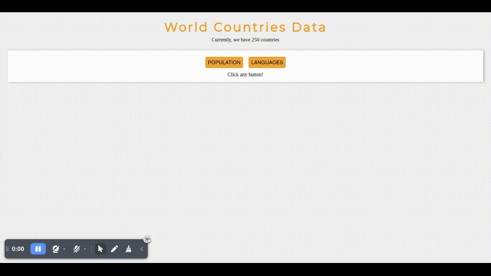
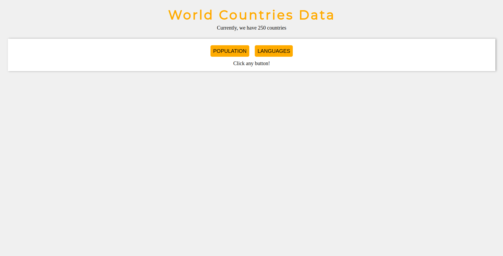
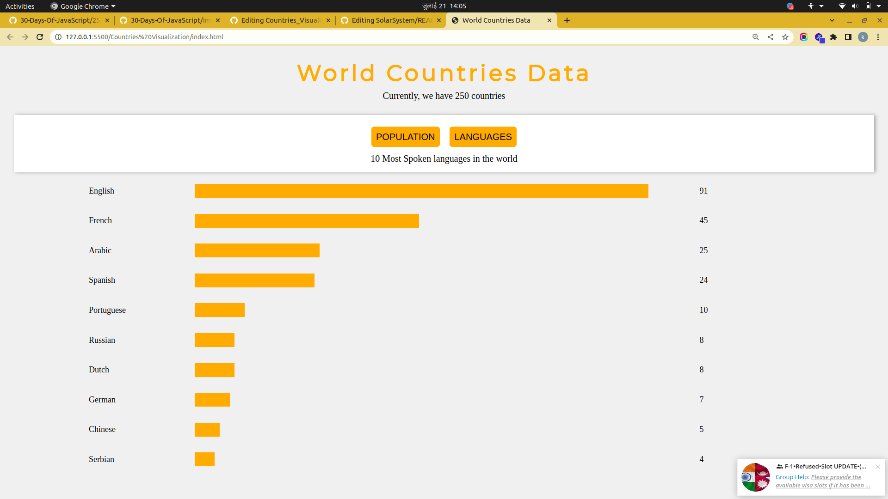

# Countries_Visualization
This is a mini project from Day 25 of 30DaysOfJavaScript by Asabeneh Yetayeh

 
## The challange
Develop a small application which calculate a weight of an object in a certain planet. The gif image is not complete check the video in the starter file.

## Design

## My Solution

### Links
- [See live site here](https://karan-niroula.github.io/Countries_Visualization/)
- [GitHub Repository](https://github.com/Karan-Niroula/Countries_Visualization)
